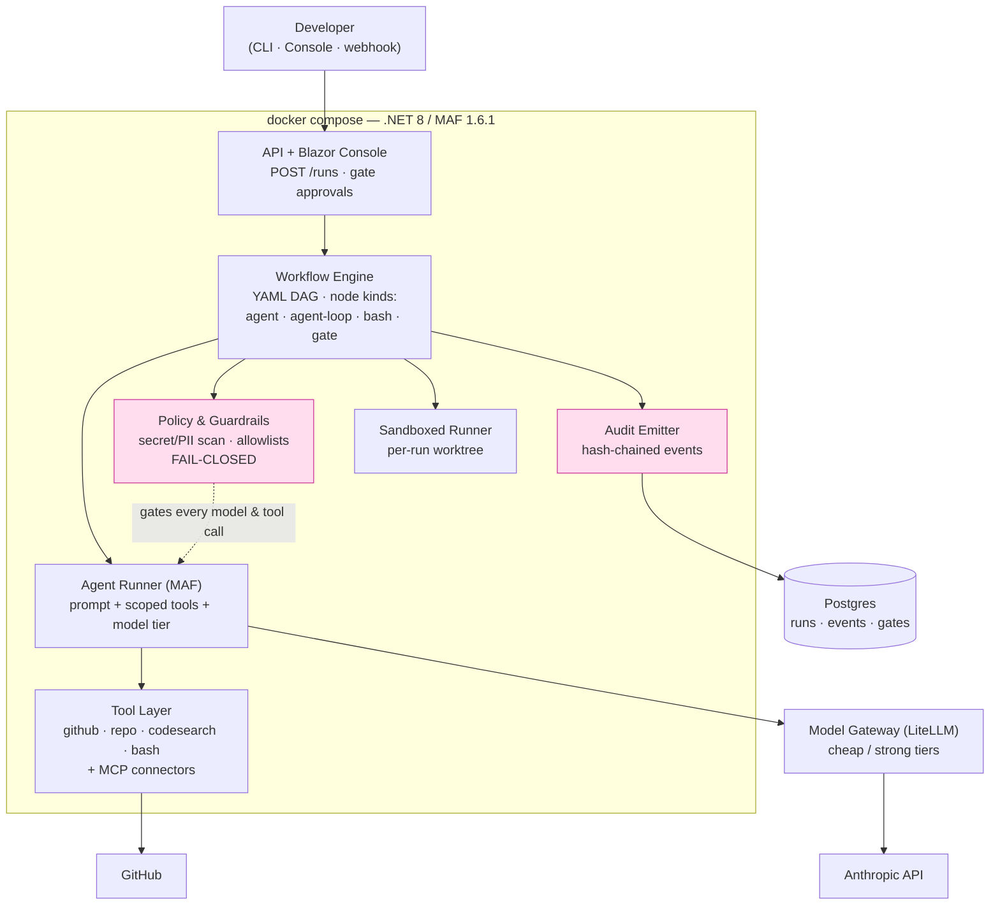
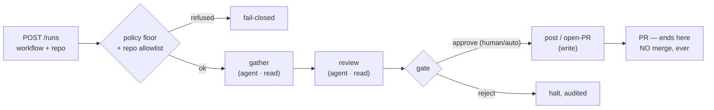
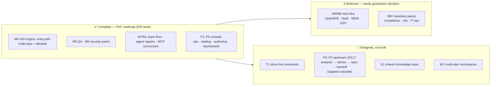

# Harness

**A governed AI workflow platform for software engineering.**
Declarative YAML workflows drive AI agents through the engineering lifecycle — review, implement,
test, secure — with fail-closed guardrails, human gates, and a tamper-evident audit trail on every
run. Built on .NET 8 and Microsoft Agent Framework, self-hosted on Docker Desktop.

> **The pitch in one line:** GitHub Actions gave teams deterministic CI they own as code — Harness
> gives teams *governed AI workflows* they own the same way, plus a console to run and author them.

---

## Why it exists

Raw LLMs and off-the-shelf coding agents are non-deterministic and hard to govern — a problem in a
regulated environment (this began as a bank-oriented design). Harness wraps the model in an
engineering harness: the intelligence fills in each step, but the **structure, permissions, gates,
and audit are owned by you** and defined as reviewable data. Every externally visible action is
gated and recorded; nothing merges, files, or ships itself.

---

## What it does today

Eleven workflows across the lifecycle run on one engine, all as data (YAML + prompts):

| Stage | Workflows | Shape |
|---|---|---|
| **Review** | `pr-review`, `pr-review-with-context`, `pr-security-review` | read-only → PR comment (auto-gated) |
| **Implementation** | `issue-to-pr` | write → PR (human-gated) |
| **QA testing** | `test-generation`, `coverage-gap-analysis`, `regression-suite-author` | run tests → author tests → PR (human-gated) |
| **Security** | `dependency-audit`, `secrets-sweep`, `threat-model-draft` | scan → triage → comment/PR (gated) |

**Proven live:** `test-generation` opened a real human-gated PR; `dependency-audit` caught a
planted High-severity CVE and posted remediation; `secrets-sweep` (pinned gitleaks) ran clean and
reported honestly. **530 offline tests.**

Plus a **Blazor operations console**: run list & live status, run/event timeline, audit-chain
viewer with verify, gate approval screen, workflow catalog & launcher, an authoring workbench
(validate + dry-run, executes nothing), a visual DAG builder (emits YAML), and suite dashboards.

---

## Architecture



The **gateway is the only path to a model** (provider-swappable: Anthropic today, Bedrock/Foundry
later — config, not code). The **policy pipeline** intercepts every model and tool call and fails
closed. The **audit chain** hashes each event over the previous one, so tampering is detectable and
every run is reproducible and attributable.

### How a run flows



---

## Design invariants (the things that never change)

1. **No merge, ever. No repo create/delete.** Workflows end at *opening a PR*; lifecycle stays human.
2. **Fail-closed.** Any policy/scanner failure pauses or blocks the run — never proceeds on error.
3. **The gateway is the only path to models.** No provider SDKs in agents; the key lives in one place.
4. **Repo/issue content is untrusted.** Agents never obey instructions embedded in a diff or ticket.
5. **Every externally visible write emits an audit event.**
6. **Workflows, prompts, agents are data** (YAML/MD) — new capability is new data, not new code.
7. **The tool catalog is curated.** External MCP servers attach only via the allowlisted connector layer.

---

## Tech stack

.NET 8 · Microsoft Agent Framework 1.6.1 · LiteLLM gateway · PostgreSQL (EF Core) · Blazor Server ·
Docker Compose · xUnit. Nine projects: `Contracts`, `Engine`, `Agents`, `Tools`, `Policy`, `Audit`,
`Runner`, `AuditCli`, `Api`.

---

## Quickstart

```bash
cp .env.example .env         # ANTHROPIC_API_KEY + a repo-scoped GitHub PAT
docker compose -f docker/compose.yaml up --build
# Console: http://localhost:8080   ·   trigger a run:
curl -X POST localhost:8080/runs -H "Content-Type: application/json" \
  -d '{"workflow":"pr-review","repo":"deniz2412/test-repo-harness","pr":1}'
# Inspect:  GET /runs/{id} · /runs/{id}/events · /runs/{id}/verify (audit chain)
```

Governance & authoring live in git: workflows in `workflows/` (with `teams/<team>/` overrides),
prompts in `prompts/`, named agents in `agents/`, the org ceiling in `policy.yaml`, external tools
in `connectors.yaml`. Changing any of them is a reviewed PR — which *is* the change-control story.

---

## Status & roadmap



**Done (this PoC):** the whole buildable roadmap — engine (M0–M3), QA & security workflow packs
(M5–M6), team ownership + policy floor + agent registry + MCP connector layer (M7/M7b/M7c), and the
full four-increment console (F1–F4).

**Deferred (a human graduation decision — new infra, spend, accounts):**
- **M4/M8 — graduation:** lift off the workstation to real infra (OpenShift, Vault, SIEM, SSO).
- **M9+ — business packs:** compliance/risk/IT-ops/knowledge workflows on the same engine and write
  ceiling, post-graduation and after a data-classification review.

**Next feature horizons (designed in `docs/product-vision.md`, not yet built):**
- **T1** — inline PR *line* comments (a small catalog-tool addition).
- **P0–P3** — extend upstream of code: business/solution analysis → user stories → an interactive
  **story → spec → implementation** handoff, with agents allowed to create work for agents under a
  **capped cascade budget** (`max_depth` / `max_fanout` / spend cap, audited as one lineage).
- **K1** — a **shared knowledge base**: trusted, PR-reviewed standards injected into agents so work
  follows one unified convention (a new *trusted* context class, kept distinct from untrusted repo content).
- **W1** — **multi-repo workspaces**: allowlisted repo groups for microservices, one PR per service,
  cross-repo changes propagated via the capped cascade and kept consistent by the shared knowledge base.

---

## Documentation

- `docs/design-spec.md` — the engineering contract (architecture, milestones, invariants).
- `docs/product-vision.md` — long-term direction (frontend, workflow packs, cascade, knowledge base, workspaces).
- `docs/*-exit-check.md` — per-milestone acceptance evidence · `REVIEW.md` — independent review gates.
- `CLAUDE.md` — working context for AI-assisted development sessions.

---

*A personal proof-of-concept. Not affiliated with any employer; runs on a single developer
workstation with a personal API key.*
